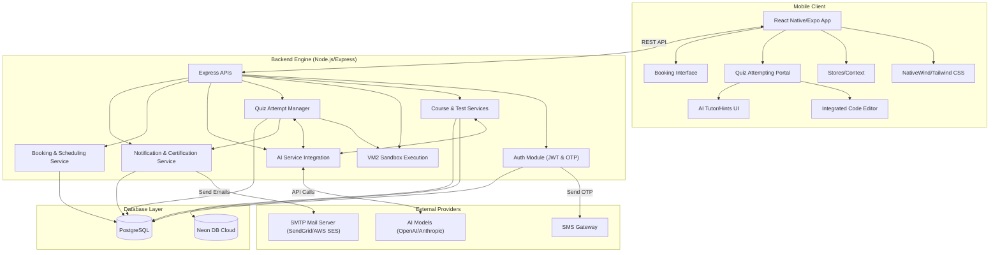

# Quizz-Portal

Welcome to the **Quizz-Portal**, a comprehensive platform for creating, managing, and taking quizzes and programming tests. This project consists of a full-featured React Native mobile application and a powerful Node.js/Express backend powered by PostgreSQL.

## 🌟 Features

### 📱 User App (Mobile)
- **User Authentication**: Secure login, registration, and profile management utilizing phone numbers and email.
- **Course Exploration**: Browse available courses and their respective tests.
- **Study Materials Hub & Progress Tracking**: Access course and test-specific study materials (PDFs, videos, source code) and track material completion progress (`material_progress`).
- **Real-Time Quiz Taking**: Smooth interface for answering questions, navigating tests, and flagging difficult questions for later review.
- **Live Code Execution**: Built-in support for coding questions with an isolated execution environment.
- **Results & Review**: Review test performance and submitted answers directly on the app (if permitted by the instructor).
- **Instant Booking**: Quickly schedule appointments, tutoring sessions, or exams directly within the app.

### ⚙️ Backend & Administration
- **Organization & Departments**: Group courses, teachers, and students by academic departments (e.g., Computer Science, Information Technology).
- **Academic Years Management**: Track courses and student progression across different academic years and semesters.
- **Course Management**: CRUD operations for courses (Create, Read, Update, Delete).
- **Study Materials Management**: Upload and manage resources (`course_materials`, `test_materials`) tied to a course or specific test.
- **Test Creation**: Organize tests under specific courses.
- **Question Bank & Randomization**: Add and manage various types of questions. Dynamically generate unique exams for each student by selecting a random subset of questions from a larger pool.
- **Advanced Analytics & Reporting**: Generate comprehensive reports on student performance, course popularity, and system usage.
- **Activity & System Logs**: Maintain a detailed audit trail of user actions, login activities, and system events.
- **Robust Security & Roles**: Role-based access control (Admin, Teacher, Student), JWT authentication, and secure password hashing.
- **Anti-Cheat Mechanisms & Violations**: Track browser, platform, and device info during test attempts. Log and monitor test violations such as tab switching or window minimizing.
- **System Settings & Device Management**: Manage global app configurations, database settings (`databaseRoutes.js`), and user registered devices directly from the admin panel.
- **Sandboxed Execution Engine**: Execute user-submitted code securely using Node VM2 to prevent malicious activities.
- **Attempt Tracking**: Start test attempts, submit answers, and finalize tests with automatic grading where applicable.

### 🎯 Quiz Attempting Portal & Compiler
- **Interactive Quiz Interface**: Clean and distraction-free UI designed for focused test-taking.
- **Integrated Code Editor**: Code directly in the portal during tests with syntax highlighting and a built-in compiler.
- **Real-Time Validation**: Automatic validation of code submissions against predefined test cases.
- **Time Management**: Built-in timers and progress tracking for timed assessments.
- **Instant Feedback**: Receive immediate results for multiple-choice questions and coding challenges after submission.

### 🤖 AI Integration & Assistance
- **Smart Question Generation**: Automatically generate quizzes and coding questions based on course topics using LLMs.
- **AI Tutor & Explanations**: Provide AI-generated explanations and hints for incorrect answers to help students learn effectively.
- **Code Analysis**: Leverage AI to analyze submitted code for best practices, optimization, and alternative solutions beyond simple test case validation.
- **Automated Grading**: Assist in grading subjective or complex programming answers using AI models.

### 📧 Notifications & Achievements
- **SMTP Email Integration**: Automated transactional emails for welcome messages, password resets, and test result summaries.
- **Automated Certification**: Generate and distribute custom digital certificates upon successful completion of courses and tests.
- **SMS / Phone Verification**: One-Time Password (OTP) integrations for secure account verification and important alerts.

## 🏗 System Architecture

Below is a Mermaid diagram illustrating the high-level architecture of the system:

## 🛠 Tech Stack

### Frontend (Mobile App / Quiz Portal)
- **Framework**: React Native with Expo (Cross-platform iOS / Android / Web support)
- **Styling**: NativeWind (Tailwind CSS for React Native)
- **State Management**: React Context / Zustand (Stores)
- **Routing**: Expo File-Based Routing (`expo-router`)
- **Code Editor UI**: Integrated syntax highlighting components tailored for mobile and web code editing during coding assessments.

### Backend (Server)
- **Runtime**: Node.js
- **Framework**: Express.js
- **Database**: PostgreSQL (Neon Database serverless integration recommended)
- **Authentication**: JWT (JSON Web Tokens) with OTP support.
- **Code Execution & Compiler Engine**: 
  - **Sandbox**: `vm2` for running user-submitted untrusted code in a highly secure, isolated environment without affecting the host server.
  - **Capabilities**: Captures `stdout` (console outputs), `stderr` (errors), and execution time for performance metrics. Validates against predefined test cases.
- **Email & Notifications**: Nodemailer / SMTP integrations for sending certifications and system alerts.
- **File Storage**: Handled securely for uploading PDFs, videos, and study materials (`course_materials`).
- **Logging**: Winston or similar structured logging utilities for activity and system logs.

### AI & Third-Party
- **AI Models**: Integration pathways for OpenAI / Anthropic APIs specifically for the `AI Service Integration` and auto-grading logic.

## 🚀 Getting Started

To run the project locally, please refer to the detailed instructions in the respective directories:
1. **[Backend Setup](backend/README.md)**: Includes instructions for setting up the PostgreSQL database (Neon or local), installing dependencies, running migrations, and starting the Express server.
2. **[Native App Setup](native/README.md)**: Includes instructions for installing Expo dependencies, starting the Metro bundler, and launching the mobile application on a simulator or device.

